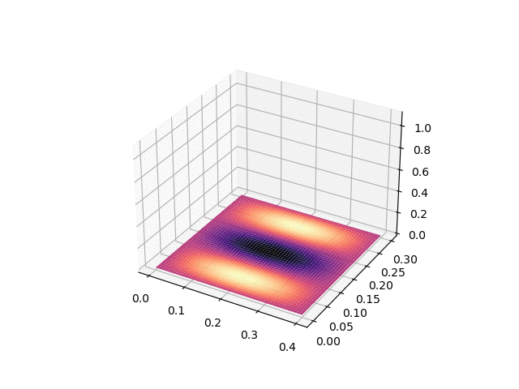
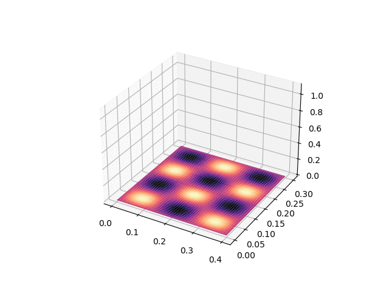

# diploma
<h1> Jupyter Notebooks for my Bachelor Thesis @ MIPT </h1>

My bachelor thesis is devoted to <b>the computation of the noise spectrum induced by turbulent boundary layer on the fuselage of subsonic passenger aircraft</b>.
Broadly, calculations involve four main steps:
<ol>
  <li>Finding eigen modes of shell vibration</li>
  <li>Computing displacement spectrum using Efimtsov model and numerical integration</li>
  <li>Obtaining displacement spectrum in the frequency domain through Fast Fourier Transform</li>
  <li>Calculating noise intensity spectrum using Vegas implementation of the Monte Carlo algorithm</li>
</ol>

<h2> Perfomance Details </h2>

All cimputations are done in the tensor fashion (because they are quite heavy) and implemented via Numpy arrays. One can simply use Numba to speed up computations (GPU version of Numpy),
however the last part with Vegas integration requires converting Numba tensors back to Numpy. Unfortunately, it kills all the perfomance. That's why caching is used as a complexity-perfomance trade-off.

<h2>Visualization of eigen modes</h2>

Some exmaples of natural vibrations of the cylindricall shell (small part of its surface).

